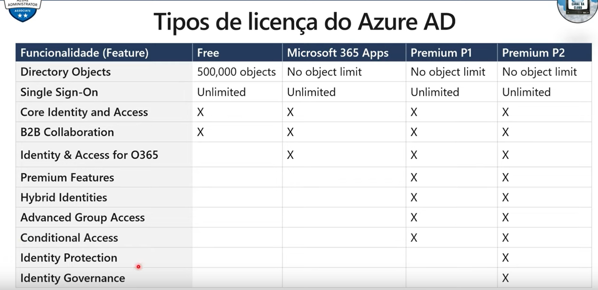

### Gereciamento de contas e usuario
- deve ser administrador global ou administrador de usuarios para gerenciar usuarios.
- o perfil do usuario (foto, trabalho, informacoes de contato) sao opcionais.
- os usuarioos excluidos podem ser restaurados por 30 dias.
- as informacoes de login e log de auditoria estao disponiveis.

### Criar contas em massa (Bulk Create)
Criar contas de usuarios em massa dentro do sistema.

- O Azure AD da suporte e atualizacoes em massa de usuarios e membros do grupo.
- crie o modelo de valores separados por virgula (CSV) que voce pode baixar do portal.
- deve estar conectado como administrador global ou administrador de usuario.

### Criar contas de grupo
Existem dois tipos de grupos que sao relevantes.

#### Tipos de Grupos:
- Grupos de seguranca 
  - nao tem exclusividade de expeiracao
  - apenas para usuarios
- Grupos do Microsoft 365 
  - podem see programados para serem excluidos em 30 dias, expirar dentro desse periodo

#### Tipos de Atribuicao
- Atribuido
- Usuario dinamico
- Dispositivo dinamico (somente grupos de seguranca)

### AD DS vs Azure Active Directory

- O Azure AD  principalmente uma solução de identidade e  projetado para comunicações HTTP e HTTPS.
- Consultado usando o API REST sobre HTTP e HTTPS, em vez de LDAP.
- Usa protocolos HTTP e HTTPS, como SAML, WS-Federation e OpenID Connect para autenticação e OAuth para autorização, em vez de Kerberos.
- Inclui serviços de federação e muitos serviços de terceiros (como o Facebook)
- Os usuários e grupos do Azure AD são criados em uma estrutura simples e não há (UOs), unidades organizacionais ou (GPSs) Objetos de Plitica de Grupo.

## Tipos de Licenca do Azure AD
Tomar cuidado com cada funcionalidade que existem entre Premium P1 e Premium P2 (mais usados em producao).

 

