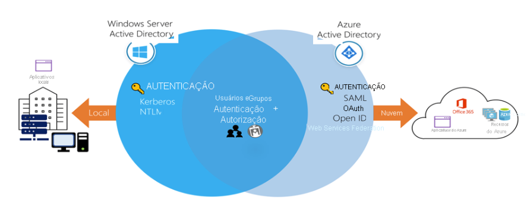

## Active Directory

O Azure AD (Active Directory) é o serviço de gerenciamento de identidade e diretório baseado em nuvem multilocatário da Microsoft. Ele ajuda a dar suporte ao acesso do usuário a recursos e aplicativos como os seguintes:

- Recursos e aplicativos internos localizados em sua rede corporativa.

- Recursos externos como o Microsoft 365, o portal do Azure e aplicativos SaaS.

- Aplicativos em nuvem desenvolvidos para sua organização.

O diagrama a seguir mostra um exemplo de implementação do Azure AD. Neste cenário, o Windows Server AD está usando a autenticação NTLM e a autenticação do Kerberos para aplicativos locais.

 

Recurso do Azure AD	Descrição

- **Acesso de SSO (logon único)**: O Azure AD fornece SSO (logon único) seguro para aplicativos Web na nuvem e para aplicativos locais. Os usuários podem entrar com o mesmo conjunto de credenciais para acessar todos os respectivos aplicativos.

- **Suporte geral de dispositivos:** O Azure AD funciona com dispositivos iOS, macOS, Android e Windows e oferece uma experiência comum em todos os dispositivos. Os usuários podem iniciar aplicativos por meio de um painel de acesso personalizado e baseado na Web, de aplicativos móveis, do Microsoft 365 ou de portais de empresa personalizados usando suas credenciais de trabalho existentes.

- **Acesso remoto seguro:** O Azure AD permite o acesso remoto seguro para aplicativos Web locais. O acesso seguro pode incluir MFA (autenticação multifator), políticas de acesso condicional e gerenciamento de acesso baseado em grupo. Os usuários podem acessar aplicativos Web locais de qualquer lugar, incluindo por meio do mesmo portal.

- **Extensibilidade de nuvem:**	O Azure AD pode ser estendido para a nuvem a fim de ajudar você a gerenciar um conjunto consistente de usuários, grupos, senhas e dispositivos em todos os ambientes.
  
- **Proteção de dados confidenciais:** Ele oferece recursos exclusivos de proteção de identidade para proteger seus dados e aplicativos confidenciais. Os administradores podem monitorar atividades de entrada suspeitas e vulnerabilidades em potencial em uma exibição consolidada de usuários e recursos no diretório.

- **Suporte de autoatendimento:** O Azure AD permite delegar a outros funcionários da empresa tarefas que precisariam ser concluídas por administradores com maiores privilégios de acesso. Fornecer acesso a aplicativos e gerenciamento de senhas de autoatendimento por meio de etapas de verificação pode reduzir as chamadas de suporte técnico e aumentar a segurança.