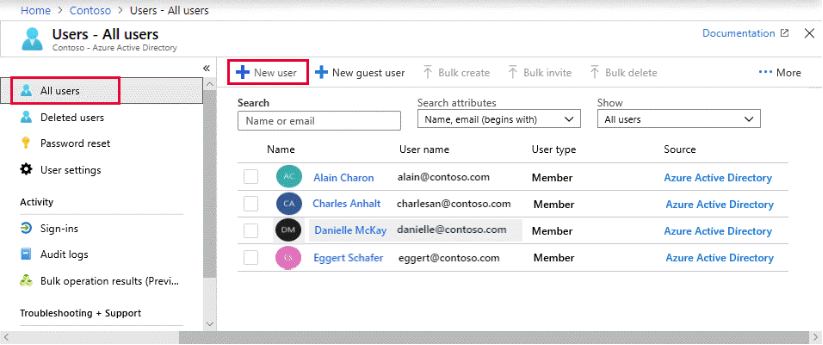

# Create users and groups
Todos os usuários que desejam acessar os recursos do Azure precisam de uma conta de usuário do Azure. Uma conta de usuário tem todas as informações necessárias para autenticar o usuário durante o processo de entrada. O Azure AD (Active Directory) dá suporte a três tipos de contas de usuário. Os tipos indicam onde o usuário está definido (na nuvem ou no local) e se o usuário é interno ou externo à sua organização do Azure AD.  

### Tópicos importantes sobre contas de usuário
- **Identidade de nuvem:** Uma conta de usuário com uma identidade de nuvem é definida apenas no Azure AD. Esse tipo de conta de usuário inclui contas de administrador e usuários que são gerenciados como parte da sua organização. Uma identidade de nuvem pode se destinar a contas de usuário definidas na sua organização do Azure AD e também para contas de usuário definidas em uma instância externa do Azure AD. Quando uma identidade de nuvem é removida do diretório principal, a conta de usuário é excluída.

- **Identidade sincronizada com o diretório**: As contas de usuário que têm uma identidade sincronizada com o diretório são definidas em um Active Directory local. Uma atividade de sincronização ocorre por meio do Azure AD Connect para levar essas contas de usuário para o Azure. A origem dessas contas é o Windows Server Active Directory.

- **Usuário convidado:** As contas de usuário convidado são definidas fora do Azure. Entre os exemplos, estão contas de outros provedores de nuvem e contas Microsoft, como uma conta do Xbox LIVE. A origem das contas de usuário convidado é o usuário convidado. As contas de usuário convidado são úteis quando fornecedores externos ou terceirizados precisam acessar seus recursos do Azure.

### Considerações sobre a escolha de contas de usuário
- **Considere onde os usuários são definidos.** Determine onde os usuários estão definidos. Todos os usuários são definidos em sua organização do Azure AD ou alguns usuários são definidos em instâncias externas do Azure AD? Você tem usuários externos à sua organização? É comum que as empresas deem suporte a dois ou mais tipos de conta na infraestrutura delas.

- **Considere o suporte para colaboradores externos.** Permita que colaboradores externos acessem recursos do Azure em sua organização dando suporte ao tipo de conta de usuário convidado. Quando o colaborador externo não exige mais acesso, você pode remover a conta de usuário e os privilégios de acesso dessa pessoa.

- **Considere uma combinação de contas de usuário.** Implemente os tipos de conta de usuário que permitem que sua organização atenda aos requisitos de negócios. Dê suporte a contas de usuário de identidade sincronizadas por diretório para usuários definidos no Windows Server Active Directory. Dê suporte a identidades de nuvem para usuários definidos em sua estrutura interna do Azure AD ou para o usuário definido em uma instância externa do Azure AD.

### Adicionar um novo usuário
Para adicionar um novo usuário, siga estas etapas:

1- Entre no portal do Azure na função Administrador de Usuário para a organização.

2- Procure e selecione Azure Active Directory em qualquer página.

3- Selecione Todos os usuários e, em seguida, selecione Novo usuário.

 

Na página do Usuário, insira as informações deste usuário:

Nome. Obrigatórios. O primeiro e último nome do novo usuário. Por exemplo, Mary Parker.

Nome de usuário. Obrigatórios. O nome de usuário do novo usuário. Por exemplo, mary@contoso.com.

A parte do domínio do nome de usuário deve usar o nome de domínio padrão inicial, <yourdomainname>.onmicrosoft.com, ou um nome de domínio personalizado, como contoso.com. Para obter mais informações sobre como criar um nome de domínio personalizado, consulte Como adicionar um nome de domínio personalizado ao portal do Active Directory do Azure.

Grupos. Opcionalmente, você pode adicionar o usuário a um ou mais grupos existentes. Você também pode adicionar o usuário aos grupos posteriormente. Para obter mais informações sobre como criar grupos do Azure AD, confira Criar um grupo básico e adicionar membros usando o Azure Active Directory.

Função do diretório: se precisar de permissões administrativas do Azure AD para o usuário, você poderá adicioná-las a uma função do Azure AD. Você pode atribuir o usuário a um Administrador global ou a uma ou mais das funções limitadas de administrador no Azure AD. Para mais informações sobre como atribuir funções, consulte Como atribuir funções aos usuários.

Informações do trabalho: você pode adicionar mais informações sobre o usuário nesse ponto ou fazer isso mais tarde. Para obter mais informações sobre como adicionar informações do usuário, consulte Como adicionar ou alterar as informações do perfil do usuário.

Copie a senha gerada automaticamente que foi fornecida na caixa Senha. Você precisará fornecer essa senha ao usuário na primeira vez que entrar.

---
- Manage licenses in Azure AD
- Create administrative units
- Manage user and group properties
- Manage device settings and device identity
- Perform bulk updates
- Manage guest accounts
- Configure self-service password reset

---